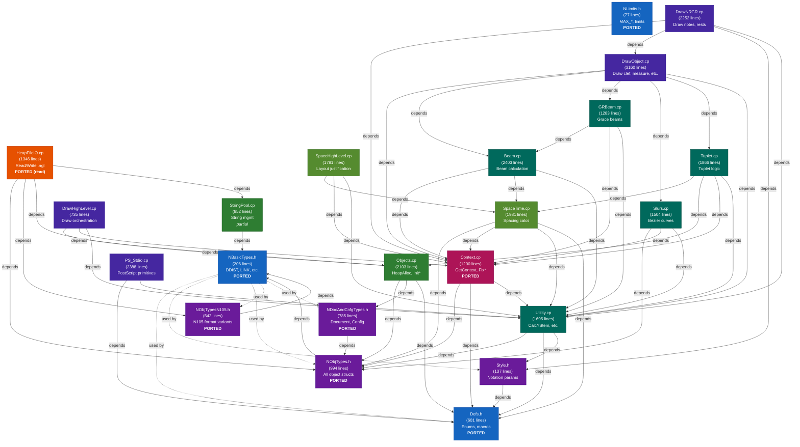

# Nightingale Dependency Chain (Mermaid)

## Legend
| Color | Category | Status |
|-------|----------|--------|
| Blue | Base types (no dependencies) | **PORTED** |
| Purple | Object type definitions | **PORTED** |
| Green | Infrastructure (alloc, strings) | Partial (read-side done) |
| Orange | File I/O | **PORTED** (read only) |
| Pink | Context propagation | **PORTED** |
| Olive | Spacing/layout | Not started |
| Teal | Engraving algorithms | Not started |
| Deep purple | Drawing/rendering | Not started |

## Rust Module Mapping
| C++ Source | Rust Module | Status |
|------------|-------------|--------|
| NBasicTypes.h | `basic_types.rs` | Done |
| NLimits.h | `limits.rs` | Done |
| defs.h | `defs.rs` | Done |
| NObjTypes.h + N105 | `obj_types.rs` | Done |
| NDocAndCnfgTypes.h | `doc_types.rs` | Done |
| HeapFileIO.cp | `ngl/reader.rs` + `ngl/interpret.rs` | Done (read) |
| Context.cp | `context.rs` | Done |
| StringPool.cp | `ngl/reader.rs` (decode only) | Partial |
| — (new) | `notelist/parser.rs` | Done |
| style.h | — | Not started |
| Objects.cp | — | Not started |
| SpaceTime.cp | — | Not started |
| SpaceHighLevel.cp | — | Not started |
| Utility.cp | — | Not started |
| Beam.cp / GRBeam.cp | — | Not started |
| Slurs.cp | — | Not started |
| Tuplet.cp | — | Not started |
| Draw*.cp | — | Not started |
