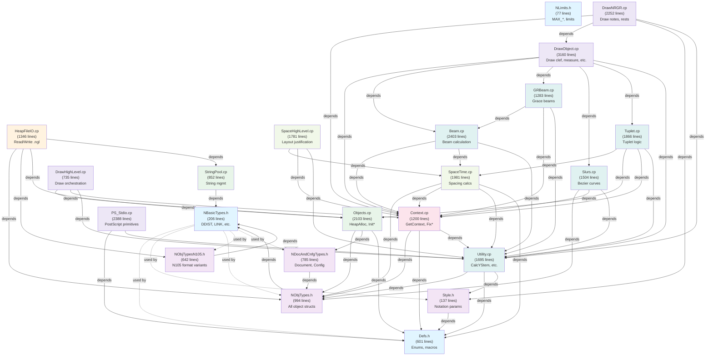

# Nightingale Dependency Chain (Mermaid)

## Legend
- Blue: Base types (no dependencies)
- Purple: Object type definitions
- Green: Infrastructure (alloc, strings)
- Orange: File I/O
- Pink: Context propagation
- Light green: Spacing/layout
- Cyan: Engraving algorithms
- Gray-purple: Drawing/rendering
